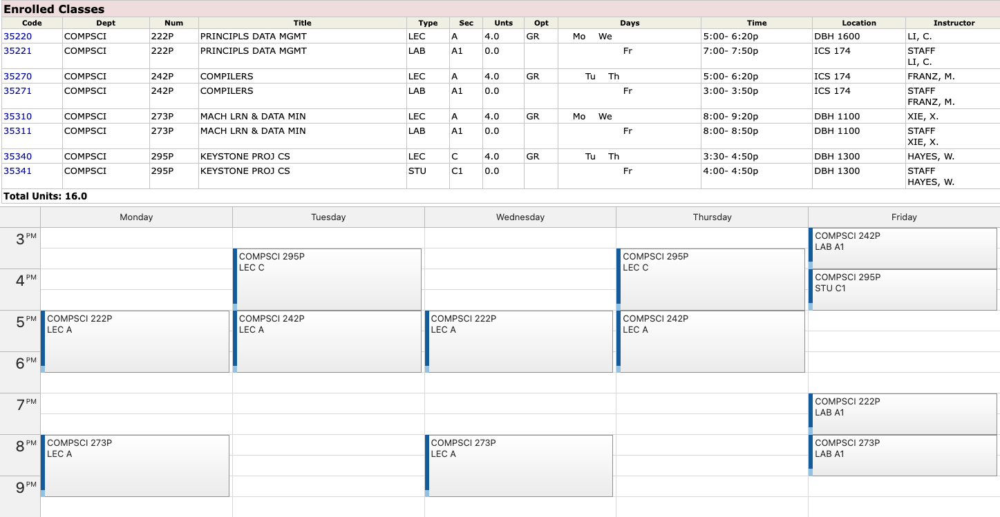

#  UCI StudyList Calendar

## Features

Chrome extension adds calendar functionality to the UCI student access studylist. 
Calendar allows students to visualize their schedule and determine if they have any conflicts.

Calendar UI created using <a href="https://javascript.daypilot.org/calendar">Daypilot Javascript Event Calendar (Lite)</a>

## Install

[**Chrome** extension]() <!-- TODO: Add chrome extension link inside parenthesis -->

---

This project was bootstrapped with [Chrome Extension CLI](https://github.com/dutiyesh/chrome-extension-cli)
